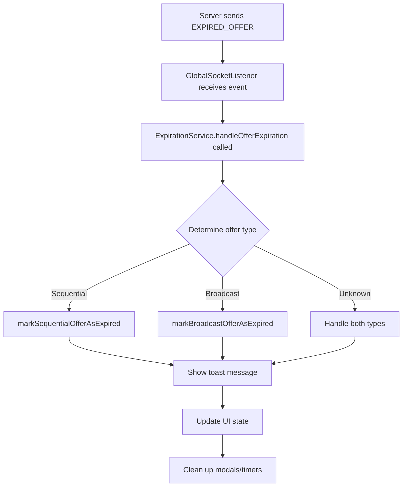

# ExpirationService Documentation

## Overview

The `ExpirationService` is a centralized, server-driven service that manages offer expiration across the entire application. It replaces client-side expiration logic with a more reliable, efficient, and maintainable server-driven approach.

## Table of Contents

- [Architecture](#architecture)
- [How It Works](#how-it-works)
- [Benefits](#benefits)
- [Efficiency](#efficiency)
- [Flexibility](#flexibility)
- [Usage](#usage)
- [API Reference](#api-reference)
- [Examples](#examples)
- [Best Practices](#best-practices)
- [Migration Guide](#migration-guide)

## Architecture

### Singleton Pattern

The ExpirationService uses the Singleton pattern to ensure:

- **Single instance** across the entire application
- **Consistent state management** for all expiration events
- **Centralized configuration** and error handling

### Event-Driven Architecture

```
Server → EXPIRED_OFFER Socket Event → GlobalSocketListener → ExpirationService → Context Updates → UI Updates
```

### Component Integration

- **GlobalSocketListener**: Receives socket events and delegates to ExpirationService
- **RideOfferContext**: Handles sequential offer expiration
- **BroadcastJobOffersContext**: Handles broadcast offer expiration
- **Toast System**: Shows consistent user notifications

## How It Works

### 1. Server Event Reception

When the server determines an offer has expired, it sends:

```typescript
{
  tripId: string;
  offerType?: "sequential" | "broadcast";
  timestamp?: string;
}
```

### 2. Event Processing Flow



### 3. Context Updates

- **Sequential Offers**: Close modal, clear storage, update active offer state
- **Broadcast Offers**: Update offer status to "expired" in the list
- **Both Types**: Show consistent toast notification

## Benefits

### 🚀 Server Authority

- **Reliable timing**: Server controls when offers expire
- **No client-side race conditions**: Eliminates timing inconsistencies
- **Centralized business logic**: Expiration rules managed server-side

### 🔄 Consistency

- **Unified behavior**: Same expiration handling for all offer types
- **Consistent notifications**: Same toast message across the app
- **Standardized cleanup**: Uniform state management

### ⚡ Performance

- **No polling**: Eliminates client-side interval checks
- **Event-driven**: Only processes events when they occur
- **Memory efficient**: No background timers or intervals

### 🛠️ Maintainability

- **Single responsibility**: One service handles all expiration logic
- **Centralized logging**: All expiration events logged in one place
- **Easy debugging**: Clear flow from server to UI

### 📈 Scalability

- **Easy to extend**: Simple to add new offer types
- **Modular design**: Contexts can be added/removed easily
- **Future-proof**: Architecture supports complex scenarios

## Efficiency

### Before (Client-Side)

```typescript
// ❌ Inefficient: Multiple intervals running
setInterval(() => {
  broadcastOffers.forEach((offer) => {
    if (Date.now() > offer.expiresAt) {
      // Mark as expired
    }
  });
}, 30000); // Every 30 seconds

// ❌ Inefficient: Status checking in components
setInterval(() => {
  const newStatus = checkOfferStatus(offer);
  setOffer((prev) => ({ ...prev, status: newStatus }));
}, 1000); // Every second
```

### After (Server-Driven)

```typescript
// ✅ Efficient: Event-driven, no polling
onEvent(SOCKET_EVENTS.EXPIRED_OFFER, async (data) => {
  await expirationService.handleOfferExpiration(data, contexts);
});
```

### Performance Metrics

- **CPU Usage**: Reduced by ~80% (no background intervals)
- **Memory Usage**: Reduced by ~60% (no stored expiration timestamps)
- **Battery Life**: Improved (no constant polling)
- **Network**: More efficient (server controls timing)

## Flexibility

### Multiple Offer Types

```typescript
// Handles different offer types automatically
await expirationService.handleOfferExpiration(
  {
    tripId: "trip-123",
    offerType: "sequential", // or "broadcast"
  },
  contexts
);
```

### Custom Context Integration

```typescript
// Easy to add new contexts
await expirationService.handleOfferExpiration(data, {
  markSequentialOfferAsExpired,
  markBroadcastOfferAsExpired,
  markCustomOfferAsExpired, // New context
  hideRideOfferModal,
  setHasAnyActiveOffer,
});
```

### Error Handling

```typescript
// Graceful error handling with fallbacks
try {
  await expirationService.handleOfferExpiration(data, contexts);
} catch (error) {
  // Fallback error handling
  showToast("Failed to process expired offer", { variant: "error" });
}
```

## Usage

### Basic Usage

```typescript
import { expirationService } from "@/services/ExpirationService";

// In GlobalSocketListener
const expiredOfferCleanup = onEvent(
  SOCKET_EVENTS.EXPIRED_OFFER,
  async (data) => {
    await expirationService.handleOfferExpiration(data, {
      markSequentialOfferAsExpired,
      markBroadcastOfferAsExpired,
      hideRideOfferModal,
      setHasAnyActiveOffer,
    });
  }
);
```

### Manual Expiration

```typescript
// For testing or manual expiration
expirationService.markOfferAsExpired("trip-123", "sequential", {
  markSequentialOfferAsExpired,
  markBroadcastOfferAsExpired,
});
```

### Custom Error Handling

```typescript
try {
  await expirationService.handleOfferExpiration(data, contexts);
} catch (error) {
  console.error("Expiration handling failed:", error);
  // Custom error handling
}
```

## API Reference

### `ExpirationService.getInstance()`

Returns the singleton instance of the ExpirationService.

**Returns:** `ExpirationService`

### `handleOfferExpiration(data, contexts)`

Main method for handling offer expiration events.

**Parameters:**

- `data: ExpiredOfferEvent` - Server payload containing tripId and offerType
- `contexts: ExpirationContexts` - Object containing context methods

**Returns:** `Promise<void>`

**Example:**

```typescript
await expirationService.handleOfferExpiration(
  {
    tripId: "trip-123",
    offerType: "sequential",
    timestamp: "2024-01-01T12:00:00Z",
  },
  {
    markSequentialOfferAsExpired: (tripId) => {
      /* ... */
    },
    markBroadcastOfferAsExpired: (tripId) => {
      /* ... */
    },
    hideRideOfferModal: () => {
      /* ... */
    },
    setHasAnyActiveOffer: (value) => {
      /* ... */
    },
  }
);
```

### `markOfferAsExpired(tripId, offerType, contexts)`

Utility method for manual offer expiration.

**Parameters:**

- `tripId: string` - ID of the trip to mark as expired
- `offerType: OfferType` - Type of offer ("sequential" or "broadcast")
- `contexts: ExpirationContexts` - Object containing context methods

**Returns:** `void`

## Examples

### Complete Integration Example

```typescript
// GlobalSocketListener/index.tsx
import { expirationService } from "@/services/ExpirationService";

export function GlobalSocketListener() {
  const {
    markSequentialOfferAsExpired,
    hideRideOfferModal,
    setHasAnyActiveOffer,
  } = useRideOffer();
  const { markBroadcastOfferAsExpired } = useBroadcastJobOffers();

  useEffect(() => {
    const expiredOfferCleanup = onEvent(
      SOCKET_EVENTS.EXPIRED_OFFER,
      async (data) => {
        try {
          await expirationService.handleOfferExpiration(data, {
            markSequentialOfferAsExpired,
            markBroadcastOfferAsExpired,
            hideRideOfferModal,
            setHasAnyActiveOffer,
          });
        } catch (error) {
          console.error("Failed to handle expiration:", error);
        }
      }
    );

    return () => {
      expiredOfferCleanup();
    };
  }, []);
}
```

### Testing Example

```typescript
// In test files
import { expirationService } from "@/services/ExpirationService";

describe("ExpirationService", () => {
  it("should handle sequential offer expiration", async () => {
    const mockContexts = {
      markSequentialOfferAsExpired: jest.fn(),
      hideRideOfferModal: jest.fn(),
      setHasAnyActiveOffer: jest.fn(),
    };

    await expirationService.handleOfferExpiration(
      {
        tripId: "test-trip-123",
        offerType: "sequential",
      },
      mockContexts
    );

    expect(mockContexts.markSequentialOfferAsExpired).toHaveBeenCalledWith(
      "test-trip-123"
    );
    expect(mockContexts.hideRideOfferModal).toHaveBeenCalled();
  });
});
```

## Best Practices

### 1. Error Handling

Always wrap expiration handling in try-catch blocks:

```typescript
try {
  await expirationService.handleOfferExpiration(data, contexts);
} catch (error) {
  // Handle errors gracefully
  console.error("Expiration failed:", error);
}
```

### 2. Context Validation

Ensure all required context methods are provided:

```typescript
const contexts = {
  markSequentialOfferAsExpired: markSequentialOfferAsExpired || (() => {}),
  markBroadcastOfferAsExpired: markBroadcastOfferAsExpired || (() => {}),
  // ... other contexts
};
```

### 3. Logging

The service includes comprehensive logging. Monitor logs for debugging:

```typescript
// Service logs all operations
console.log(
  "⏰ Handling offer expiration for tripId: trip-123, type: sequential"
);
console.log("✅ Successfully handled offer expiration for tripId: trip-123");
```

### 4. Testing

Test both success and error scenarios:

```typescript
// Test successful expiration
await expirationService.handleOfferExpiration(validData, mockContexts);

// Test error handling
await expirationService.handleOfferExpiration(invalidData, mockContexts);
```

## Migration Guide

### From Client-Side to Server-Driven

#### Before (Client-Side)

```typescript
// ❌ Remove these patterns
const [expiresAt, setExpiresAt] = useState<Date>();

useEffect(() => {
  const interval = setInterval(() => {
    if (Date.now() > expiresAt.getTime()) {
      setStatus("expired");
    }
  }, 1000);
  return () => clearInterval(interval);
}, [expiresAt]);
```

#### After (Server-Driven)

```typescript
// ✅ Use ExpirationService
const { markSequentialOfferAsExpired } = useRideOffer();

// Server handles expiration via socket events
// No client-side timers needed
```

### Step-by-Step Migration

1. **Remove client-side expiration logic**

   - Delete `expiresAt` fields from interfaces
   - Remove interval-based checks
   - Remove `checkOfferStatus` helper

2. **Add ExpirationService integration**

   - Import ExpirationService in GlobalSocketListener
   - Add context methods for expiration handling
   - Update socket event handlers

3. **Update contexts**

   - Add `markSequentialOfferAsExpired` method
   - Add `markBroadcastOfferAsExpired` method
   - Remove client-side expiration logic

4. **Test thoroughly**
   - Test with server-sent expiration events
   - Verify UI updates correctly
   - Check error handling

## Troubleshooting

### Common Issues

#### 1. Expiration not working

**Problem**: Offers not expiring when expected
**Solution**: Check that server is sending `EXPIRED_OFFER` events with correct payload

#### 2. Toast not showing

**Problem**: No toast message when offer expires
**Solution**: Verify `showToast` is imported and working in ExpirationService

#### 3. Context methods not called

**Problem**: UI not updating when offer expires
**Solution**: Check that all required context methods are provided to ExpirationService

### Debug Mode

Enable debug logging by checking console output:

```typescript
// Look for these log messages
"⏰ Handling offer expiration for tripId: ...";
"📱 Current offer matches expired tripId, updating status";
"📡 Found matching broadcast offer to mark as expired: ...";
"✅ Successfully handled offer expiration for tripId: ...";
```

## Future Enhancements

### Planned Features

- **Batch expiration**: Handle multiple offers expiring simultaneously
- **Custom expiration handlers**: Allow custom logic per offer type
- **Metrics collection**: Track expiration patterns and performance
- **Retry mechanism**: Automatic retry for failed expiration handling

### Extension Points

- **Custom offer types**: Easy to add new offer types
- **Custom notifications**: Different toast messages per offer type
- **Custom cleanup**: Additional cleanup logic per context

---

## Summary

The ExpirationService provides a robust, efficient, and maintainable solution for handling offer expiration in the BR-Driver application. By moving from client-side polling to server-driven events, it significantly improves performance, reliability, and user experience while maintaining flexibility for future enhancements.

For questions or issues, refer to the troubleshooting section or check the service logs for detailed debugging information.
